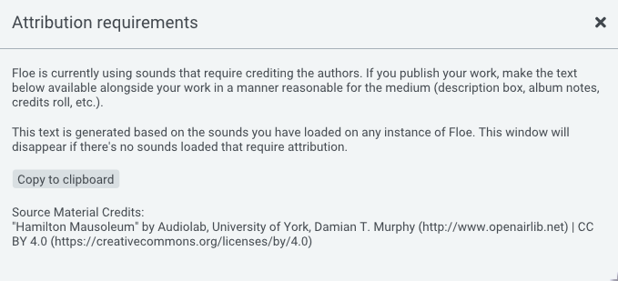

<!--
SPDX-FileCopyrightText: 2024 Sam Windell
SPDX-License-Identifier: GPL-3.0-or-later
-->

# Attribution

Sample library developers can license their libraries in various ways. Most developers use a license that allows you to use the sounds without having to credit them.

However, Floe gracefully supports sample libraries that require you to credit the creator of the sounds.

Typically, the requirement is that you must supply a bit of attribution text along with your music. This can be in any reasonable place depending on the medium you are sharing your music. Examples include a caption on a website, album notes or credits roll.

The most common licenses that require attribution are the Creative Commons licenses, such as the [CC BY](https://creativecommons.org/licenses/by/4.0/) license. This license allows you to use the sounds for free, even in commercial projects, as long as you credit the creator.

For some people, giving attribution is a deal-breaker. But here's some reasons why it might not be so bad:
- Attributions can support the creators of sounds - providing them with recognition, traffic, and potential customers.
- Sharing where your sounds come from helps other musicians find great sounds too - increasing the quality of music everywhere.
- Attributions can look professional and show a high level of care in your work.

Floe makes it dead-easy to comply with attribution requirements. When you use a sound from a library that requires attribution, Floe will show a small icon in the top of the window. Clicking this will show you the exact text that you can copy-and-paste wherever you need to. Floe tracks all attribution requirements across all instances of Floe, so you only need to do it once.

_Example of the attribution GUI in Floe_
