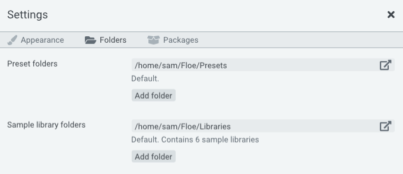

<!--
SPDX-FileCopyrightText: 2024 Sam Windell
SPDX-License-Identifier: GPL-3.0-or-later
-->

# Sample Libraries

Floe uses a custom sample library format. It's an open format consisting of a folder of audio files and a file in the [Lua](https://en.wikipedia.org/wiki/Lua_(programming_language)) programming language called `floe.lua`. 

Access to the audio files gives you the freedom to use a library's sounds in other software too.

> Openness is a key goal of Floe sample libraries. 
> 
> There's no proprietary file formats. There's just FLAC, WAV and Lua. By using widely-used file formats we ensure the longevity of libraries.

You can use libraries developed by others or you can [develop your own](../develop/develop-libraries.md). Developing your own libraries does require some basic programming knowledge.

Sample libraries are easily installed when they're packaged into [Floe's package format](../develop/package-format.md); on the settings panel there is a 'install package' button. You can also manually install libraries by placing them in a folder that Floe scans.

For backward compatibility, Floe also supports [Mirage's](mirage.md) sample library format.

Floe's sample library format is designed to be extended. We are planning to add new features to the format while always retaining backwards compatibility.

## Your library folders

Floe automatically scans for sample libraries in a set of folders. You can configure these folders in Floe's settings panel, which is opened by clicking the <i class="fa fa-cog"></i> cog icon at the top of Floe's window. Subfolders are scanned too.

The default library folder cannot be removed, but you can add and remove any other folders you like.

## Moving libraries (external drives, etc.)

You may rearrange your libraries in your folders as you see fit. Floe will automatically detect changes and apply them.

For example, you can move your existing libraries to another location (including an external drive):
1. Open your library folder by clicking on the <i class="fa fa-external-link"></i> link button. 
1. Copy-and-paste the library folders to your desired new location. Libraries are named something like this: 'FrozenPlain - Slow'.
1. Add this new location to Floe's settings by clicking the 'Add Folder' button and selected the folder you pasted everything to. Remember, Floe scans the entire folder and its subfolders, you don't need to add each library individually - add the parent folder instead.

