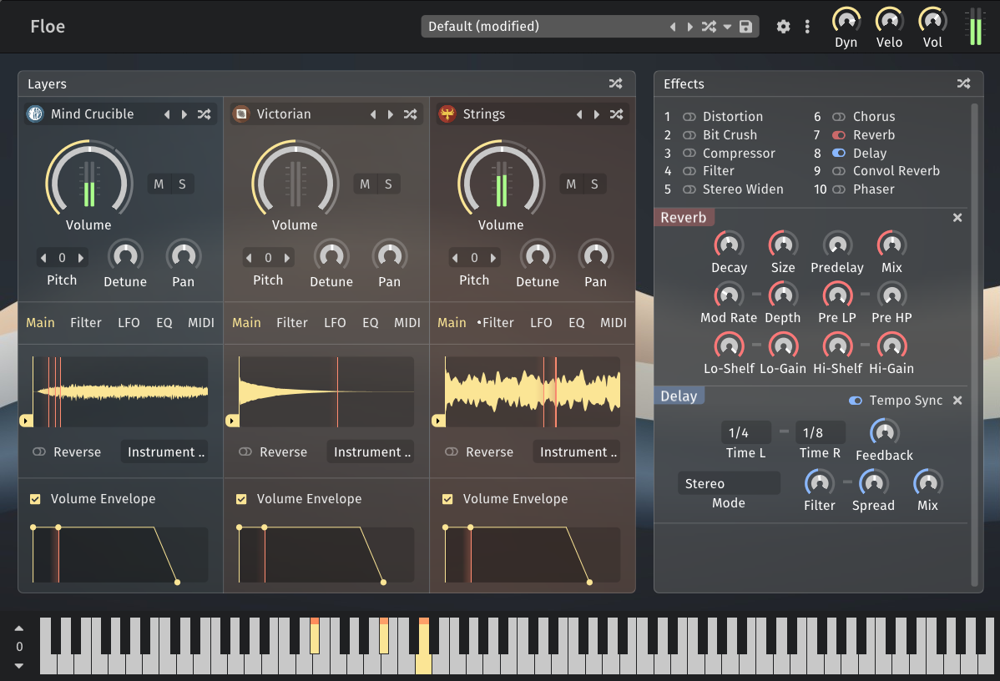

<!--
SPDX-FileCopyrightText: 2024 Sam Windell
SPDX-License-Identifier: GPL-3.0-or-later
-->

IMPORTANT: Floe is not finished yet.

    <picture>
        <source media="(prefers-color-scheme: dark)" srcset="https://raw.githubusercontent.com/Floe-Project/Floe-Logos/HEAD/horizontal_transparent.svg">
        <source media="(prefers-color-scheme: light)" srcset="https://raw.githubusercontent.com/Floe-Project/Floe-Logos/HEAD/horizontal_transparent_dark.svg">
        
    </picture>

<h1 style="font-size: 3.1rem">Streamlined sample-based instrument platform</h1>

Floe lets you find, perform and transform sounds from sample libraries — from realistic instruments to synthesised tones. No-hassle, open-source and always free.

Floe is an engine, it requires sample libraries to play.

Alpha version of Floe's GUI showing multiple libraries loaded.

<a href="https://floe.audio/installation/download-and-install-floe.html" style="
  background-color: #555e85; 
  border: none; 
  border-radius: 4px; 
  color: white; 
  padding: 15px 32px; 
  text-align: center; 
  text-decoration: none; 
  display: inline-block; 
  font-size: 16px; 
  font-weight: bold; 
  margin: 4px 2px; 
  cursor: pointer; 
  box-shadow: 0 2px 5px rgba(0,0,0,0.2); 
  transition: all 0.3s ease;">Download Now</a>

## Find the perfect sound
Floe loads sample libraries in the [Floe format](./usage/sample-libraries.md), and provides a standard interface for finding instruments and presets across libraries via categories, tags and search features. You'll be able to quickly find the production-ready sound your music needs.

## Craft unique sounds
Floe's three-layer architecture allows for instruments to be shaped and blended together — including mixing different sample libraries. Additional processing is available with a rack of ==effects-count== built-in effects.

Furthermore, Floe's loop and crossfade controls allow for exploration of the world between realistic multisampling and sample-based synthesis. 

## Widely compatible
It's available as a plugin for your DAW (CLAP, VST3 and AU) on Windows and macOS. It's free and open-source and always will be due to its GPL licence. There's no lock-in, no sign-up, no nagging, just a focus on helping you make music.

## Built on a solid foundation
Floe's ancestor, Mirage, has been used by thousands of musicians and producers — professional and hobbyist — in 13 products. Floe is the next step in the evolution of Mirage, with a renewed focus on developing a hassle-free platform for new sample libraries.

## Ongoing development
Floe is an ongoing project. We plan to expand its capabilities while always maintaining backwards compatibility. We're always open to feedback and suggestions. By consolidating our efforts into improving this engine, we improve the capabilities of all of its libraries.

It's developed by the creator of [FrozenPlain](https://frozenplain.com). FrozenPlain offer a range of sample libraries that will be updated to support the Floe format. We're hoping to see other developers adopt the format too.

## Floe's mission
> 1. Make sample libraries more expressive, playable and effective in music production.
> 1. Lengthen the lifespan of sample libraries by providing a open-source platform for them with no lock-in.
> 1. Prioritise helping people make meaningful music; not technical hassle, commercial pressure or unnecessary complexity.

## About this website
This website contains everything you need to know about Floe. It's presented in a book-like format, with chapters in the sidebar. 

If you're viewing this online, you might find the search feature useful: open it by clicking the <i class="fa fa-search"></i> magnifying glass icon at the top-left of the page. Additionally, there is a <i class="fa fa-print"></i> print icon at the top-right for either printing this book, or saving it to a PDF.

