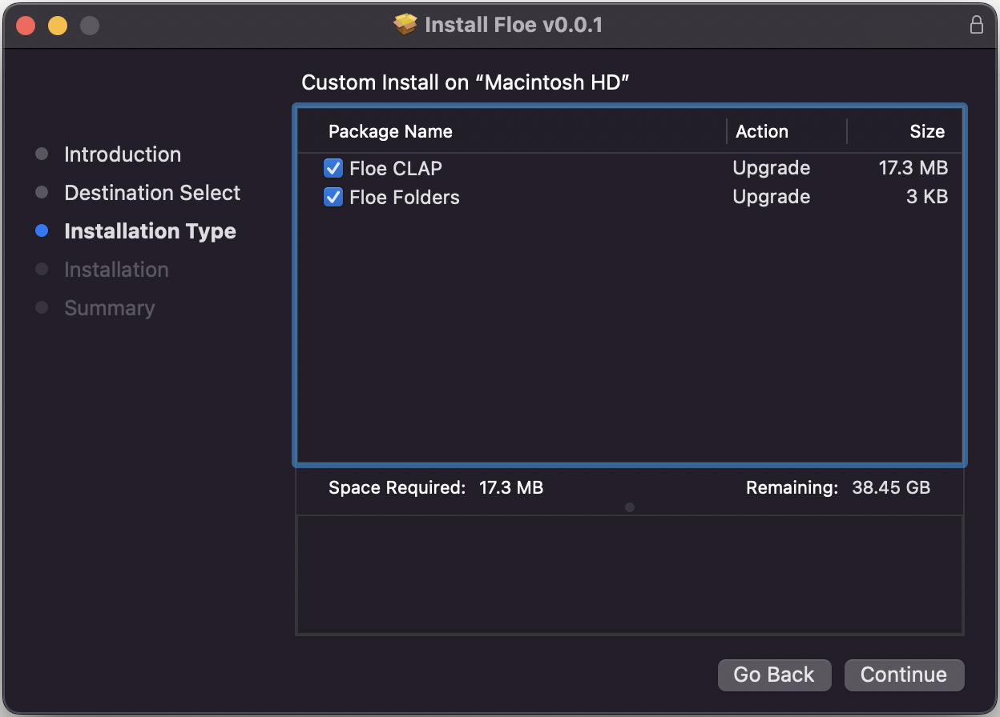
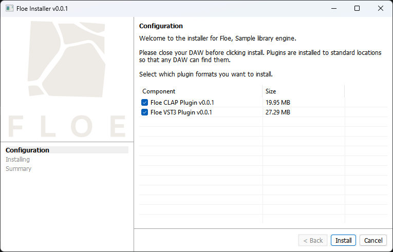

<!--
SPDX-FileCopyrightText: 2024 Sam Windell
SPDX-License-Identifier: GPL-3.0-or-later
-->

# Download & Install Floe

Please give Floe a try, but it's not ready for daily use yet. 
There's no AU version and there's <a href="https://github.com/Floe-Project/Floe/issues?q=is%3Aissue%20state%3Aopen%20type%3ABug%20milestone%3Av1.0.0">known bugs</a>.

There's two ways to install Floe: use the installer, or manually move files. 

Either way, Floe is backwards-compatible[^pre-releases]. This means that you can replace an old version of Floe with a new version and everything will work.

Please check the [requirements](requirements.md) before downloading. 

Additional information:
- Floe is totally free, there's no signup or account needed; just download and install.
- Sample libraries and presets are installed separately via [packages](../packages/install-packages.md).
- The latest released version of Floe is v==latest-release-version==.

[^pre-releases]: Main releases are backwards compatible, but alpha and beta versions do not have this guarantee.

## Installer

> **<i class="fa fa-windows"></i> Floe Installer Windows**: ==Floe-Installer-Windows-markdown-link==
> 
> **<i class="fa fa-apple"></i> Floe Installer macOS**: ==Floe-Installer-macOS-markdown-link==

Download, unzip, and run the installer program. The installer will guide you through the installation process, including choosing the plugin formats you want to install. 

Once the installation is complete you might need to restart your DAW in order for it to find the Floe plugins.

## Manually Install

> **<i class="fa fa-windows"></i> Floe Manual Install Windows**: ==Floe-Manual-Install-Windows-markdown-link==
> 
> **<i class="fa fa-apple"></i> Floe Manual Install macOS**: ==Floe-Manual-Install-macOS-markdown-link==

Normally you'll want to use the installer, but there could be some cases where you'd prefer to install Floe manually. To allow for this, we provide a zip file that contains Floe's plugin files. Extract it and move the files to your plugin folders.

##### Windows:
- CLAP: Move `Floe.clap` into `C:\Program Files\Common Files\CLAP`
- VST3: Move `Floe.vst3` into `C:\Program Files\Common Files\VST3`

##### macOS:
- CLAP: Move `Floe.clap` into `/Library/Audio/Plug-Ins/CLAP`
- VST3: Move `Floe.vst3` into `/Library/Audio/Plug-Ins/VST3`
- AU: Move `Floe.component` into `/Library/Audio/Plug-Ins/Components`

## 

---

Download links can also be found on the [Github releases page](https://github.com/Floe-Project/Floe/releases/latest).
