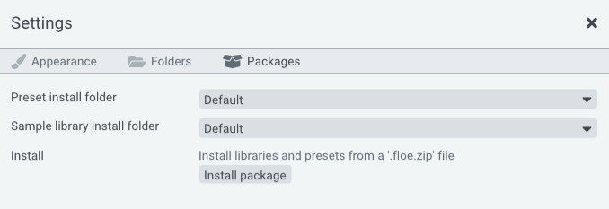

<!--
SPDX-FileCopyrightText: 2024 Sam Windell
SPDX-License-Identifier: GPL-3.0-or-later
-->

# Installing Libraries & Presets

Floe installs libraries and presets from ZIP files called Floe Packages.

Simply click the 'Install package' button in Floe's settings panel and direct it to the package ZIP file. It will extract the libraries and presets into the correct folders. No need to restart Floe.

### Here's the full details

1. Open Floe.
1. Open the Settings panel using the gear icon at the top.
1. Open the Packages tab.
1. Click the 'Install package' button and direct it to the package ZIP file.
1. Done. After installation, you may delete the ZIP file. No need to restart Floe.

## Manually installing

Alternatively, you can manually install libraries and presets by extracting the ZIP file into the correct folders.

1. Extract the package ZIP file (floe.zip).
1. Open Floe.
1. Open the Settings panel using the gear icon at the top.
1. Open the Folders tab.
1. Here you can control which folders Floe looks for libraries and presets in. Copy/move the contents of this package's Libraries into one of Floe's library folders, and the same for Presets into one Floe's presets folder.
1. Done. No need to restart Floe.
