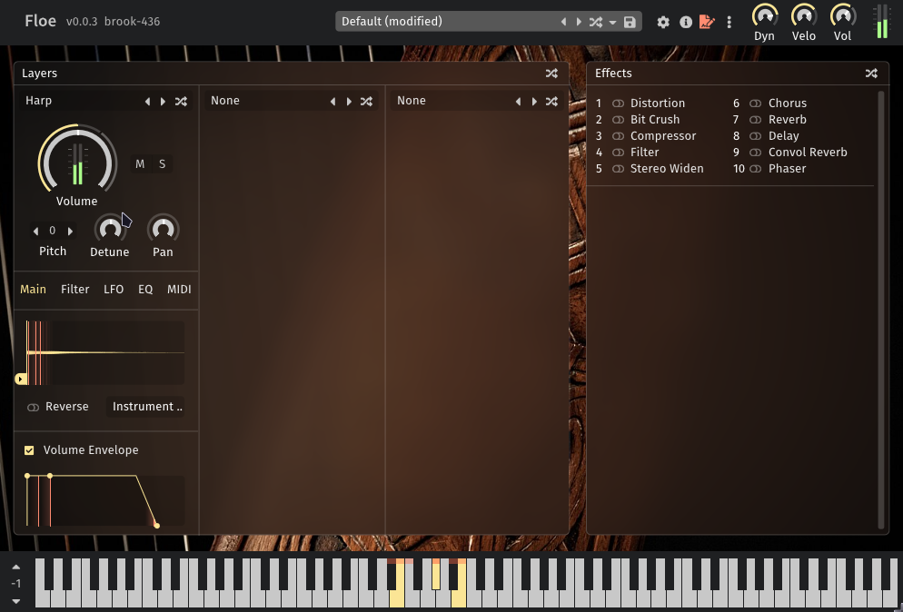
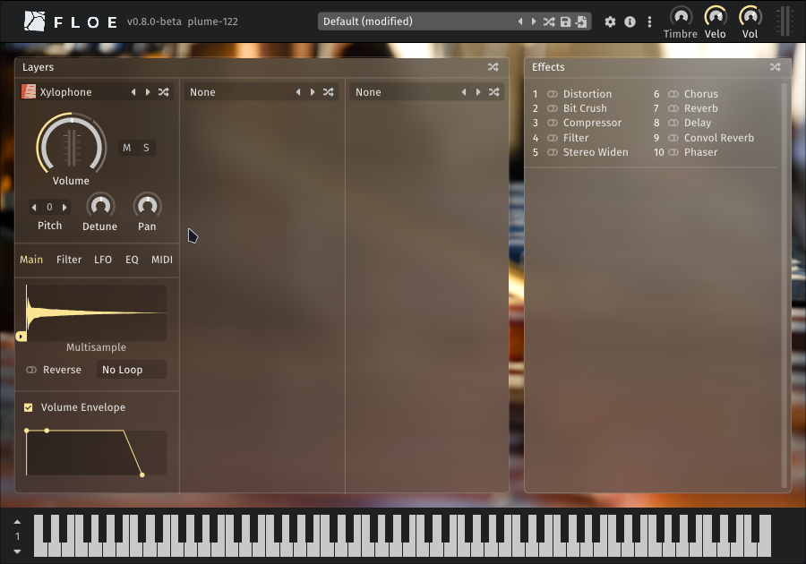
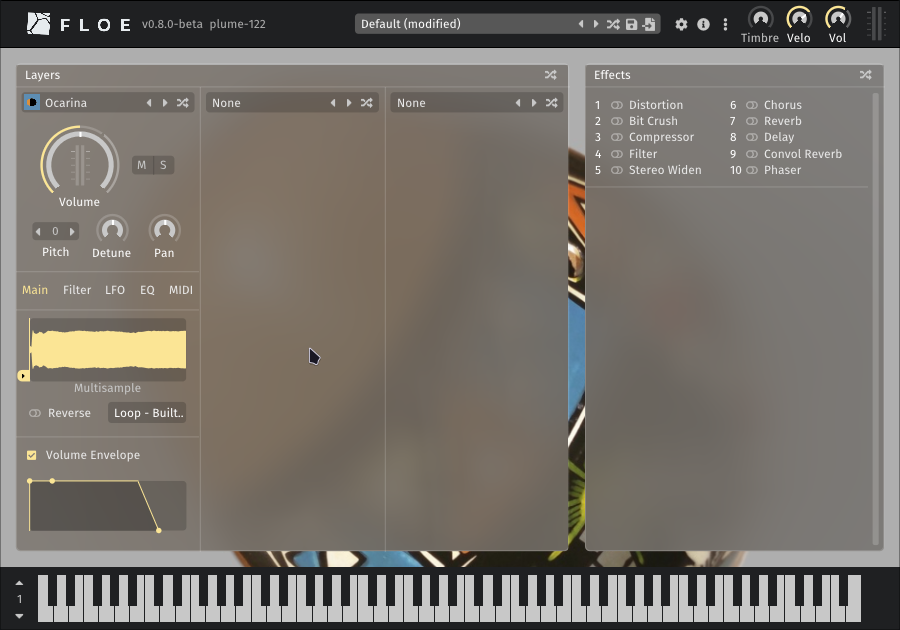

<!--
SPDX-FileCopyrightText: 2025 Sam Windell
SPDX-License-Identifier: GPL-3.0-or-later
-->

# Available Packages

Floe can [install libraries and presets](./install-packages.md) from ZIP files called _Floe packages_.

Here are some available packages.

## Celtic Harp

_The background image is [Harpe Celtique Telenn Gentañ - Alan Stivell - 04](https://commons.wikimedia.org/wiki/File:Harpe_Celtique_Telenn_Genta%C3%B1_-_Alan_Stivell_-_04.jpg) by Jérémy Kergourlay, and is licensed under [CC BY-SA 4.0](https://creativecommons.org/licenses/by-sa/4.0/deed.en)._

We made a Floe-compatible version of [Etherealwinds Harp 2: Community Edition](https://versilian-studios.com/etherealwinds-harp/) by [Versilian Studios](https://versilian-studios.com/) which is licensed under a [Creative Commons Attribution 4.0 International License](https://creativecommons.org/licenses/by/4.0/deed.en). It's a high-quality multisampled harp with velocity layers and round robins. Versilian Studios have a more advanced version of this harp available for purchase.

| Celtic Harp | |
|:--|:--|
| Cost | Free -  [attribution required](../usage/attribution.md) ([CC-BY](https://creativecommons.org/licenses/by/4.0/deed.en)) |
| Repository | [Floe-Project/Harp](https://github.com/Floe-Project/Harp) |
| Presets | 0 |
| Download | [Download Versilian Studios - Etherealwinds Harp 2 CE Package.floe.zip](https://github.com/Floe-Project/Harp/releases/download/v1.0/Versilian.Studios.-.Etherealwinds.Harp.2.CE.Package.floe.zip) |
| Download Size | 93.4 MB |

## Xylophone

_The background image is [Xylophone and percussion](https://www.flickr.com/photos/crashingwaves/688290359) by CrashingWaves, licensed under [CC BY 2.0](https://creativecommons.org/licenses/by/2.0/)._

This is a basic free multisampled xylophone from [FreePats](https://freepats.zenvoid.org/), converted into a Floe library.

| Xylophone | |
|:--|:--|
| Cost | Free - no attribution required (public domain) |
| Repository | [Floe-Project/Xylophone](https://github.com/Floe-Project/Xylophone) |
| Presets | 0 |
| Download | [Download FreePats - Xylophone Package.floe.zip](https://github.com/Floe-Project/Xylophone/releases/download/v1.0/FreePats.-.Xylophone.Package.floe.zip) |
| Download Size | 2.6 MB |

## Ocarina

This is a basic free ocarina from [FreePats](https://freepats.zenvoid.org/), converted into a Floe library.

| Ocarina | |
|:--|:--|
| Cost | Free - no attribution required (public domain) |
| Repository | [Floe-Project/Ocarina](https://github.com/Floe-Project/Ocarina) |
| Presets | 0 |
| Download | [Download FreePats - Ocarina Package.floe.zip](https://github.com/Floe-Project/Ocarina/releases/download/v1.0/FreePats.-.Ocarina.Package.floe.zip) |
| Download Size | 4.3 MB |

## FrozenPlain
[FrozenPlain](https://www.frozenplain.com) will be converting all of their libraries to the Floe format.
