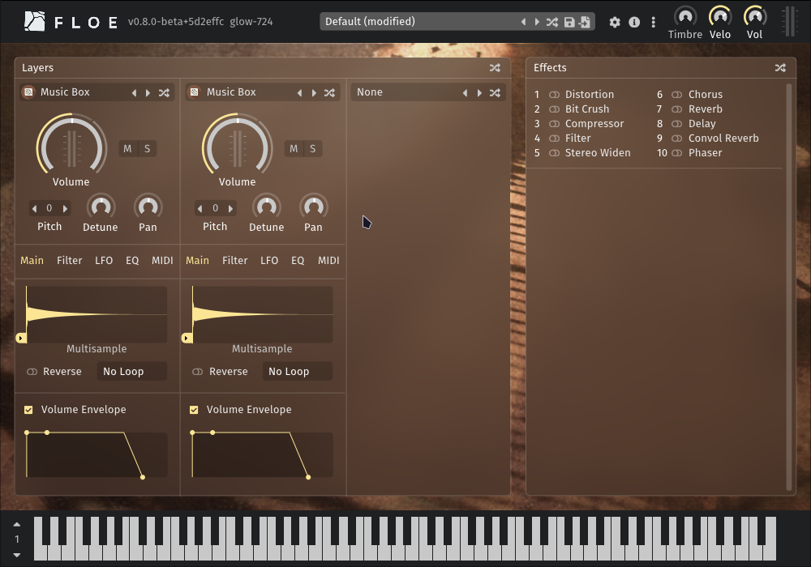
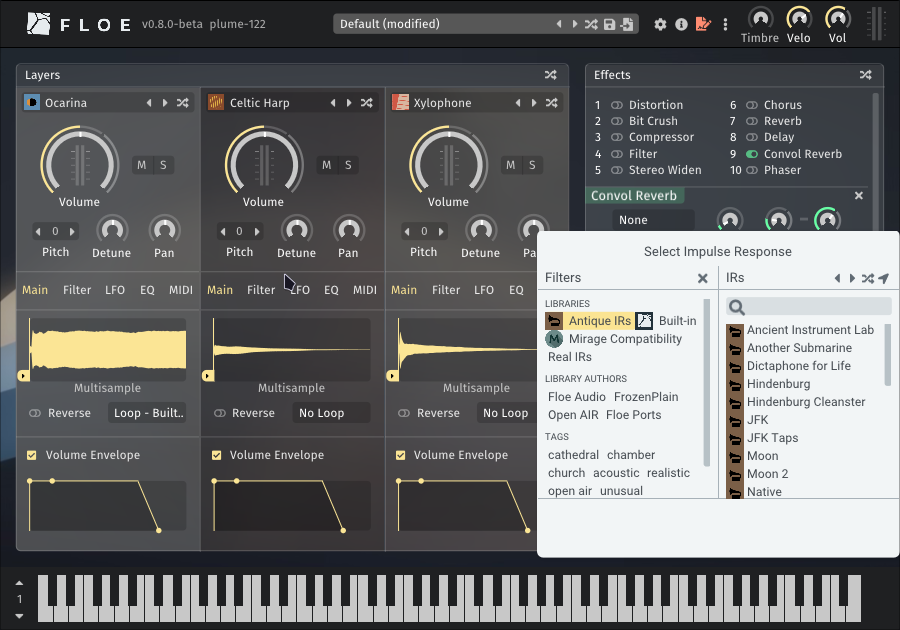

<!--
SPDX-FileCopyrightText: 2025 Sam Windell
SPDX-License-Identifier: GPL-3.0-or-later
-->

# Available Packages

Floe can [install libraries and presets](./install-packages.md) from ZIP files called _Floe packages_.

Here are some available packages.

## Music Box Suite Free - Free

Free multisampled music box from [FrozenPlain](https://www.frozenplain.com/).

| Music Box Suite Free | |
|:--|:--|
| Cost | Free - no attribution required (FrozenPlain’s license) |
| Instruments | 1 |
| Presets | 12 |
| Impulse Responses | 0 |
| Download | [Go to webpage](https://www.frozenplain.com/product/music-box-suite-free) |
| Download Size | 5.0 MB |

## Celtic Harp - Free (attribution required)

_The background image is [Harpe Celtique Telenn Gentañ - Alan Stivell - 04](https://commons.wikimedia.org/wiki/File:Harpe_Celtique_Telenn_Genta%C3%B1_-_Alan_Stivell_-_04.jpg) by Jérémy Kergourlay, and is licensed under [CC BY-SA 4.0](https://creativecommons.org/licenses/by-sa/4.0/deed.en)._

We made a Floe-compatible version of [Etherealwinds Harp 2: Community Edition](https://versilian-studios.com/etherealwinds-harp/) by [Versilian Studios](https://versilian-studios.com/) which is licensed under a [Creative Commons Attribution 4.0 International License](https://creativecommons.org/licenses/by/4.0/deed.en). It's a high-quality multisampled harp with velocity layers and round robins. Versilian Studios have a more advanced version of this harp available for purchase.

| Celtic Harp | |
|:--|:--|
| Cost | Free -  [attribution required](../usage/attribution.md) ([CC-BY](https://creativecommons.org/licenses/by/4.0/deed.en)) |
| Repository | [floe-audio/Harp](https://github.com/floe-audio/Harp) |
| Instruments | 1 |
| Presets | 0 |
| Impulse Responses | 0 |
| Download | [Download Floe Ports - Celtic Harp Package.zip](https://github.com/floe-audio/Harp/releases/download/v1.3/Floe.Ports.-.Celtic.Harp.Package.zip) |
| Download Size | 120.4 MB |

## Xylophone - Free

_The background image is [Xylophone and percussion](https://www.flickr.com/photos/crashingwaves/688290359) by CrashingWaves, licensed under [CC BY 2.0](https://creativecommons.org/licenses/by/2.0/)._

This is a basic free multisampled xylophone from [FreePats](https://freepats.zenvoid.org/), converted into a Floe library.

| Xylophone | |
|:--|:--|
| Cost | Free - no attribution required (public domain) |
| Repository | [floe-audio/Xylophone](https://github.com/floe-audio/Xylophone) |
| Instruments | 1 |
| Presets | 0 |
| Impulse Responses | 0 |
| Download | [Download Floe Ports - Xylophone Package.zip](https://github.com/floe-audio/Xylophone/releases/download/v1.3/Floe.Ports.-.Xylophone.Package.zip) |
| Download Size | 2.6 MB |

## Ocarina - Free

This is a basic free ocarina from [FreePats](https://freepats.zenvoid.org/), converted into a Floe library.

| Ocarina | |
|:--|:--|
| Cost | Free - no attribution required (public domain) |
| Repository | [floe-audio/Ocarina](https://github.com/floe-audio/Ocarina) |
| Instruments | 1 |
| Presets | 0 |
| Impulse Responses | 0 |
| Download | [Download Floe Ports - Ocarina Package.zip](https://github.com/floe-audio/Ocarina/releases/download/v1.3/Floe.Ports.-.Ocarina.Package.zip) |
| Download Size | 4.3 MB |

## Antique IRs - Free

Give your presets a vintage sound using this library of impulse responses that simulate old audio equipment.

It's a Floe port of NoiseCollector's impulses response library; created with the use of public domain recordings of historical events. Vintage equipment like dicta-phones, old film reels, vintage vinyl, wax cylinders, and magnetic wire.

Impulses can be used to simulate war reports, old radio broadcasts, space missions, and other vintage sounds with a convolution reverb.

| Antique IRs | |
|:--|:--|
| Cost | Free - no attribution required (public domain) |
| Repository | [floe-audio/Antique-IRs](https://github.com/floe-audio/Antique-IRs) |
| Instruments | 0 |
| Presets | 0 |
| Impulse Responses | 27 |
| Download | [Download Floe Ports - Antique IRs Package.zip](https://github.com/floe-audio/Antique-IRs/releases/download/v1.0/Floe.Ports.-.Antique.IRs.Package.zip) |
| Download Size | 1.1 MB |

## Mirage Compatibility - Free

Compatibility files for working the FrozenPlain Mirage libraries inside Floe.

For Mirage libraries to fully work inside Floe, the Mirage Compatibility library is needed. This library will normally be included alongside Mirage libraries, but it can also be installed separately.

| Mirage Compatibility | |
|:--|:--|
| Cost | Free - no attribution required (FrozenPlain's license) |
| Download | [Download FrozenPlain - Mirage Compatibility Package.zip](https://github.com/FrozenPlain/floe-mirage-compatibility/releases/download/v1.1/FrozenPlain.-.Mirage.Compatibility.Package.zip) |
| Download Size | 8.9 MB |

## Mirage Libraries
Floe fully supports all Mirage libraries: [FrozenPlain shop](https://www.frozenplain.com/products).
