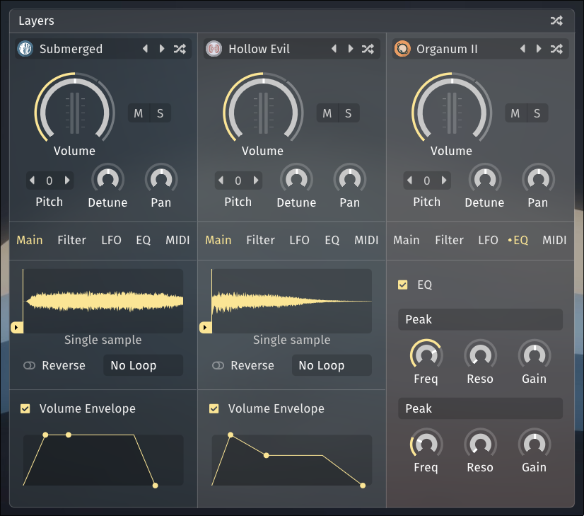

<!--
SPDX-FileCopyrightText: 2024 Sam Windell
SPDX-License-Identifier: GPL-3.0-or-later
-->

# Layers

Floe is built around an architecture of three layers. These are displayed in three columns starting from the left of the main panel. Each layer is identical. Floe’s layers are the first things in the processing chain; each layer is processed in parallel, and then the three streams of audio are mixed together and fed through the effects rack, from top to bottom.

## Instruments

Each layer can contain an instrument. The instrument is the sound generator. It's like an oscillator in a traditional synthesizer. However, for Floe, instruments are sample-based. Sometimes an instrument is a realistic, complex multisampled real musical instrument, sometimes it's a single looping sample. Floe also has a couple of basic synth waveforms designed for layering with other instruments.

To load an instrument, click the menu button at the top of the layer. Change it from 'None' to an instrument of your choice. You will be able to pick from any of the instruments that are available in the libraries that you have installed.

How an instrument works is defined in the library that it comes from. Most instrument allow for adding or customising sample loops.

## Sound shaping

You can shape the sound of each layer in quite a few ways.

