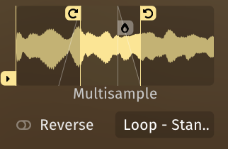
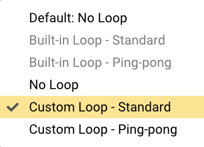

<!--
SPDX-FileCopyrightText: 2025 Sam Windell
SPDX-License-Identifier: GPL-3.0-or-later
-->

# Looping

One of the ways that Floe extends into the realm of sample-based synthesis is by offering some powerful looping features.

These looping features adapt to whichever instrument is loaded (the instrument being the sound generator that was loaded into a layer). The GUI makes it clear what the available options are. 

Most instruments allow you to loop the sound in some way - even when the instrument is a multisampled instrument. However, sample library developers can choose to offer built-in loops, only allow certain modes or disable looping altogether.

There are 2 loop modes available in Floe: standard wrap-around looping and ping-pong looping. In the standard mode, the sound will jump back to the start of the loop when it reaches the end. In ping-pong mode, the sound will alternate playing forwards and backwards through the loop. A crossfade can be applied to smooth the boundary - even in ping-pong mode.

As well as looping, you can control whether the sounds are reversed or have their start position offset.

