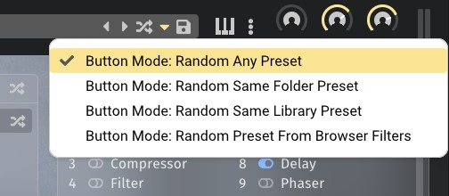

<!--
SPDX-FileCopyrightText: 2025 Sam Windell
SPDX-License-Identifier: GPL-3.0-or-later
-->

# Presets

Floe can save its current state as a preset file, which can be loaded later. It's the same file type regardless of what sample libraries you're using; a `.floe-preset` file. When you load a preset, Floe will check that you have the required libraries installed, and if not, it will show an error.

Presets are portable - you can copy them to other computers or operating systems. You can rearrange them into folders and rename them as you like.

## Preset browser

Floe features a browser for conveniently navigating and loading presets from your preset folders. This browser has two panels. The panel on the left is used to select the folder to browse. The panel on the right is used to load presets from within the selected folder and its subfolders. You can use the arrow keys on your keyboard to move to different presets on the right panel.

You can also search for folders or files by typing into the search bar on this panel. Your search term is compared against each filepath of every preset in the currently shown folder.

## Preset folders

Floe automatically scans for presets in a set of folders - including subfolders. This works in the exact same way as your [library folders](./sample-libraries.md).

Presets are tiny files and so there's typically no need to move then to an external hard-drive.

## Preset randomisation

Floe has a multi-mode 'randomise preset' button. This button can be found in the top panel of Floe’s GUI. To the left of this button is a downwards arrow icon. By clicking on this arrow you can select the mode of the randomise button. These are the options:

- Randomise Any: Loads any Floe preset in the presets folder (included any presets in subfolders). The preset could be for any library.
- Randomise Library: Loads any Floe preset that is for the same library that is currently loaded. For example, if you have the Wraith library loaded, this button will load another Wraith preset.
- Randomise Folder: Loads any Floe preset that is in the same folder as the current one. For example, if your current loaded preset is in a folder called 'Pads', another preset from 'Pads' will be loaded.
- Randomise based on filter text: Loads a folder that matches the filtered folders and search text that you have typed into the preset browser. This button works the same as the randomise button that is adjacent to the search bar on the preset browser panel.
