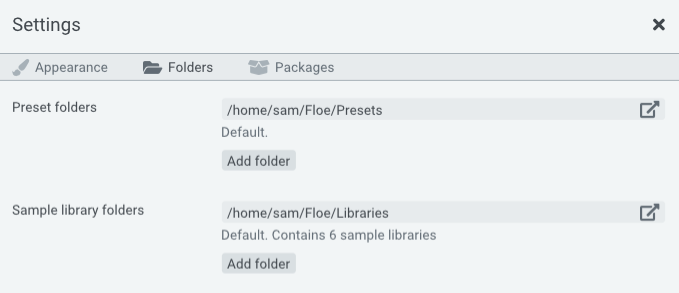

<!--
SPDX-FileCopyrightText: 2024 Sam Windell
SPDX-License-Identifier: GPL-3.0-or-later
-->

# Sample Libraries

Floe is an engine that requires _Floe sample libraries_ to make sound. This page describes Floe's sample library format and how to manage your libraries.

Related pages:
- [Available libraries](../packages/available-packages.md)
- [How to install libraries](../packages/install-packages.md)
- [Develop your own libraries](../develop/develop-libraries.md) (programming required)

_Floe also supports the legacy [Mirage](../about-the-project/mirage.md) library format_.

## Custom open format

Floe sample libraries use a custom, open format consisting of a folder of audio files and a file in the [Lua](https://en.wikipedia.org/wiki/Lua_(programming_language)) programming language called `floe.lua`. 

Access to the audio files gives you the freedom to use a library's sounds in other software too.

> Openness is a key goal of Floe sample libraries. 
> 
> There's no proprietary file formats. There's just FLAC, WAV and Lua. By using widely-used file formats we ensure the longevity of libraries.

## Portable

Sample libraries are just normal folders. They don't reference anything outside their folder, meaning they totally portable; you can move libraries to other locations, or even to other computers/operating systems due to their cross-platform nature.

## View installed libraries

You can view your installed libraries by clicking the <i class="fa fa-info-circle"></i> info button on Floe's main window.

## Library folders

Floe automatically scans for sample libraries in a set of folders. You can configure these folders in Floe's preferences panel, which is opened by clicking the <i class="fa fa-cog"></i> cog icon at the top of Floe's window. Subfolders are scanned too.

The default library folder cannot be removed, but you can add and remove any other folders you like.

## Moving and rearranging libraries

You may rearrange your libraries within your folders as you see fit. Floe will automatically detect changes and apply them. For example, you might want to create subfolders for different types of libraries, or to separate libraries from different developers.

You can also move your existing libraries to another location, such as an external drive. 

To do this, you will need to move the libraries in File Explorer/Finder, and then add the new location in Floe's preferences.

Here's that process in more detail:
1. Create your new library folder at your desired location. For example, create "Floe Libraries" somewhere on your external drive.
1. Open the Preferences panel by clicking the <i class="fa fa-cog"></i> cog icon at the top of Floe's window.
1. Under 'Folders', click on the <i class="fa fa-external-link"></i> link button for the folder that you want to move libraries out of. A File Explorer/Finder window will open.
1. Use File Explorer/Finder to move the libraries to your desired new location (libraries are folders — typically with this naming pattern: 'Developer - Library-name').
1. Go back into Floe, and add the new location by clicking the 'Add Folder' button. Remember, Floe will find libraries inside subfolders as well as the top-level, so select the "Floe Libraries" folder (or whatever name you chose), instead of the individual library folders.
